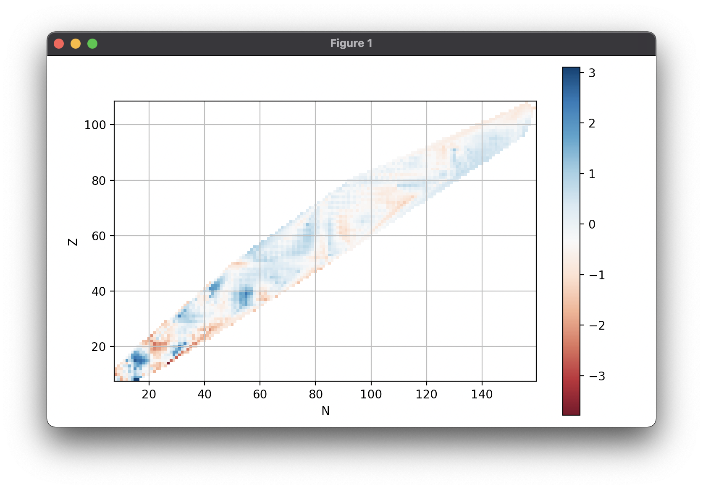

# masstable

Utilities for working with nuclear mass tables

### Create a table

    >>> from masstable import Table
    >>> ame = Table('AME2003')

### Supported tables

To access the list of supported tables:

    >>> Table.names
    Out[2]:
    ['AME2003',
     'AME2003all',
     'AME2012',
     'AME2012all',
     'AME1995',
     'AME1995all',
     'DUZU',
     'FRDM95',
     'KTUY05',
     'ETFSI12',
     'HFB14',
     'HFB26',
     'TCSM12',
     'BR2013',
     'MAJA88',
     'GK88',
     'WS32010',
     'WS32011',
     'SVM13']

### Inspecting tables

To view the beginning or the end sample of Table object, use the ``head`` and
``tail`` methods. The default number of elements to display is five, but you
may pass a custom number same as in pandas:

    >>> ame.head()
    Out[4]:
    Z  N
    0  1     8.071317
    1  0     7.288970
       1    13.135722
       2    14.949806
    2  1    14.931215
    Name: AME2003, dtype: float64

    >>> ame.tail(3)
    Out[5]:
    Z    N
    104  157    101.315395
    108  156    119.599066
    106  159    112.817611
    Name: AME2003, dtype: float64

### Indexing, accessing elements

Table objects support fancy indexing. For example to list all lead(Z=82) isotopes:

    >>> ame[82,:]
    Out[7]:
              AME2003
    Z  N
    82 96    3.567800
       98   -1.939209
       99   -3.144762
       100  -6.826135
       101  -7.568734
       102 -11.045339
       ...

    >>> ame[82,126:128]
    Out[8]:
              AME2003
    Z  N
    82 126 -21.748455
       127 -17.614440
       128 -14.728292

To access a simple element just do:

    >>> ame[82,126]
        Out[9]:
              AME2003
    Z  N
    82 126 -21.748455

    >>> Table('AME1995')[82,126]
    Out[11]:
              AME1995
    Z  N
    82 126 -21.763563

For more complicated relations the ``select`` method can be used. For example to select all nuclei with A > 160 we can do:

    >>> A_gt_160 = lambda Z,N: Z + N > 160
    >>> Table('AME2003').select(A_gt_160)

### Convenience methods

Calculate the root mean squared error of Möller, et al. *Atomic Data and Nuclear Data Tables*, **59** (1995), 185-351:

    >>> Table('FRDM95').rmse(relative_to='AME2003')
    0.890859326191
    >>> Table('FRDM95')[8:,8:].rmse()
    0.6555037788616391

Find the first odd-odd nuclei of Möller's mass table:

    >>> Table('FRDM95').odd_odd
    Out[13]:
    Z   N
    9   9       1.21
        11      0.10
        13      3.08
        15      9.32
    ...

You can access the whole list of Z, N or A in a Table object via ``ame.Z``, ``ame.A``, etc.

### Separation energies

The following derived quantities are available:

- ``q_alpha``: Q-value of beta decay
- ``q_beta``: Q-value of beta decay
- ``s2n``, ``s1n``: Neutron separation energies
- ``s2p``, ``s1p``: Proton separation energies

For example:

    >>> duzu = Table('DUZU')
    >>> duzu.s2n.tail()
    Out[29]:
    Z    N
    119  179    13.412634
    120  178    14.282634
    121  177    15.222634
    122  176    16.122634
    123  175          NaN
    Name: s2n(DUZU), dtype: float64

### Plotting

    import matplotlib.pyplot as plt

    fig, ax = plt.subplots()
    ax = Table('FRDM95').error().chart_plot(ax=ax)
    plt.show()

